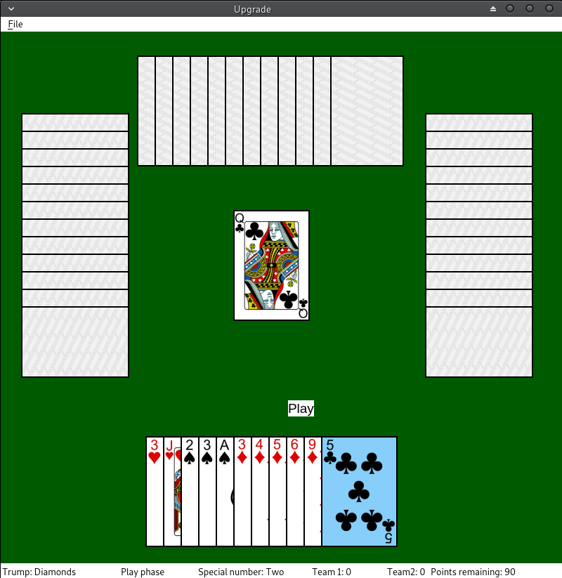

# Upgrade card game

"Upgrade" is a two vs. two team card game played using a deck of 54 cards. The team which receives the most "upgrades" wins the game. To get an upgrade, the team must win the last hand and win at least 60 of the 100 possible points in a round. For more information, please see the rules folder.

# Development status

* In progress...

# Try it yourself

1. Clone this repository with ``git clone https://github.com/nathanesau/UpgradeCardGame``
2. Run ``pipenv install`` to install required python dependencies (note: ``pipenv`` must be installed)
3. Run ``pipenv shell`` to start the virtualenv
4. Run ``python src/main.py`` to start the game

Tests can be run using ``py.test`` from within the virtualenv

# Info

* Written in Python using *PyQt5* package
